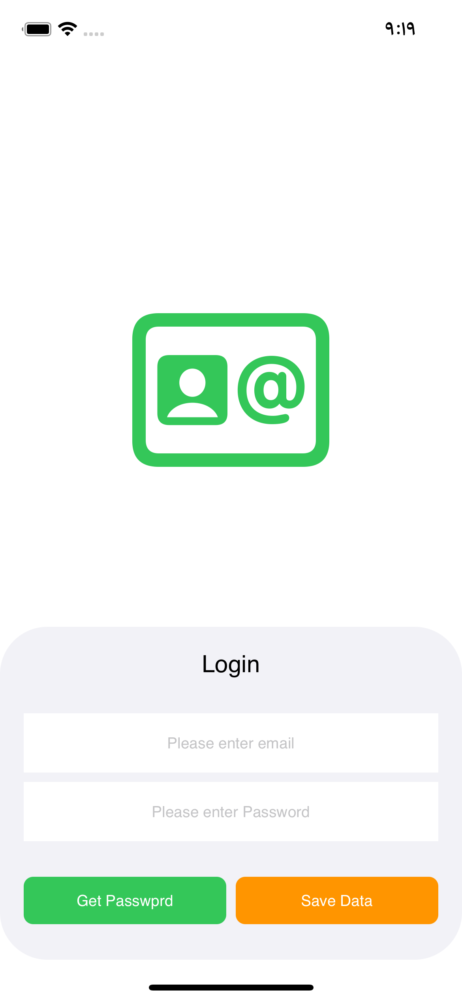

# Technicalisto

## IOS Swift : How to save Password for remember me using pod 'KeychainAccess'

1. in pod file add

```
  pod 'KeychainAccess'
  
```



2. Try

```

func getPassword(){
DispatchQueue.global().sync {
    
do {
let password = try self.keychain
.authenticationPrompt("Are You want to get saved Email & Passowrd ?")
.get("password")
if password != nil { self.passwordTxt.text = password }
} catch _ {}
            
do {
let email = try self.keychain
.get("email")
if email != nil { self.emailTxt.text = email }
} catch _ {}
    
}}

```
```

func savePassword(){
DispatchQueue.global().sync {
do {
try self.keychain
.accessibility(.whenPasscodeSetThisDeviceOnly, authenticationPolicy: [.biometryAny])
.set(self.passwordTxt.text ?? "", key: "password")
} catch _ {}
            
do {
try self.keychain
.set(self.emailTxt.text ?? "", key: "email")
} catch _ {}
        
}}
 
 ```
 
 ```
    
func normalGet(){
    
let email = keychain[string: "email"]

let password = keychain[string: "password"]

self.emailTxt.text = email

self.passwordTxt.text = password

}
```

```
func normalSet(){
do {
try keychain.set(emailTxt.text ?? "" , key: "email")
}
catch let error { print(error) }

do {
try keychain.set(passwordTxt.text ?? "" , key: "password")
}
catch let error { print(error) }
  
}

```

### Thanks

This app is inspired by Aya Baghdadi”
and copyright for [@Technicalisto](https://www.youtube.com/channel/UC7554uvArdSxL4tlws7Wf8Q)
